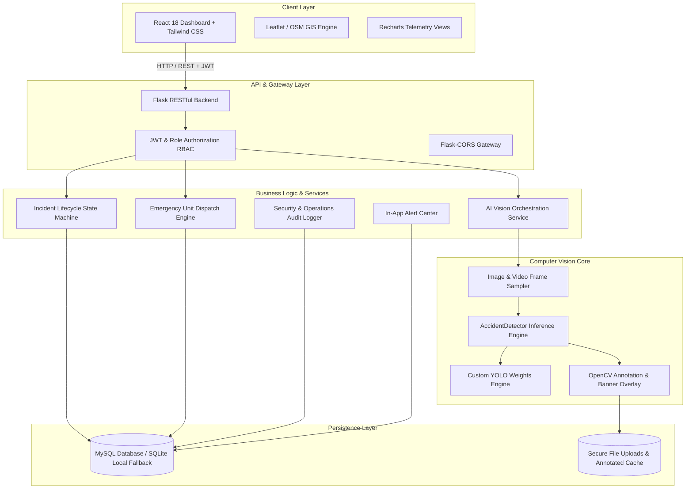

# System Architecture & Technical Specifications

## 1. Overview
The **AI-Based Smart Emergency Response & Accident Detection System (SER System)** is an integrated public safety platform designed to ingest surveillance media, run computer vision inference to detect potential vehicular accidents, enforce human-in-the-loop verification, and coordinate multi-agency emergency response units (Ambulance, Police, Fire & Rescue).

## 2. Component Diagram



## 3. Emergency Response Lifecycle

```
[Camera / Upload] ──> [AI Detection Result] ──> [Pending Human Verification]
                                                        │
                      ┌─────────────────────────────────┴───────────────────┐
                      ▼                                                     ▼
              [Verified Incident]                                  [Rejected Incident]
                      │                                                     │
                      ▼                                                     ▼
           [Select Response Unit]                                      [Cancelled]
           (Ambulance/Police/Fire)
                      │
                      ▼
               [Unit Assigned]
                      │
                      ▼
                 [Dispatched]
                      │
                      ▼
                  [En Route]
                      │
                      ▼
                  [On Scene]
                      │
                      ▼
                  [Resolved]
```

## 4. Key Architectural Guarantees
1. **Human-in-the-Loop Safeguard**: Active field dispatch (`Dispatched`, `En Route`, `On Scene`) is strictly disallowed for unverified incidents.
2. **Model Integrity**: The system never falsely advertises generic object detection as accident detection. If dedicated collision weights are absent, a transparent diagnostic mode is indicated.
3. **Database Portability**: Runs natively against MySQL server in production, while maintaining transparent zero-config fallback to localized SQLite for sandbox evaluation.
